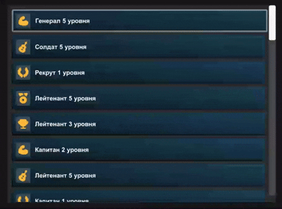

# Тестовое задание Alternativa Games: Динамический список элементов

Реализация скроллящегося списка с анимированными элементами в Unity

## Задача
Сверстать динамический список из разных по содержанию элементов, около 50 штук

-содержит иконку, заголовок
-индикацию, что элемент выделен (рамку или цвет)
-выделение управляется стрелками клавиатуры
-при нажатии, элемент плавно разворачивается или сворачивается, отображает второй текст
-список должен иметь скролл, двигаться касанием и, при управлении с клавиатуры, двигаться к выделенному элементу
-дизайн элементов должен содержать градиент и скругления углов
-данные для отображения можно взять произвольные
-использовать можно MonoBehaviour и классы, без сторонних библиотек

## Демонстрация

